# Niñerapp

Niñerapp es una plataforma móvil diseñada para conectar a padres de familia con niñeros(as) de confianza. La aplicación permite a los usuarios gestionar los perfiles de sus hijos, buscar y solicitar servicios de cuidado, comunicarse en tiempo real y llevar un registro detallado del historial de servicios.

---

## Características principales

- **Gestión de perfiles**: Crea tu cuenta, configura tu perfil y añade información detallada sobre tus hijos (alergias, cuidados especiales, etc...).
- **Búsqueda de niñeros(as)**: Explora una lista de profesionales disponibles y revisa sus perfiles y calificaciones.
- **Solicitud de servicios**: Programa un servicio de cuidado de manera rápida y sencilla.
- **Comunicación por chats**: Chatea directamente con el niñero asignado para coordinar detalles y recibir actualizaciones.
- **Historial completo**: Lleva un registro de todos los servicios pasados para mayor seguridad y control.

---

## Pantallas de la aplicación

A continuación, se muestra el flujo de la aplicación con sus respectivas interfaces:

### 1. Autenticación y acceso
Acceso seguro y registro rápido para comenzar a usar la plataforma.

| Login | Registro |
|:---:|:---:|
| 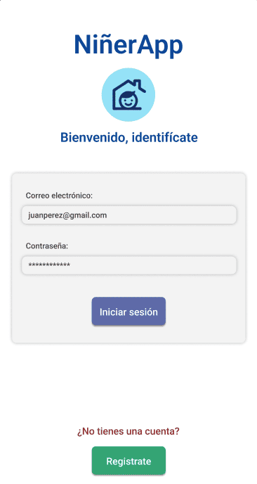 | 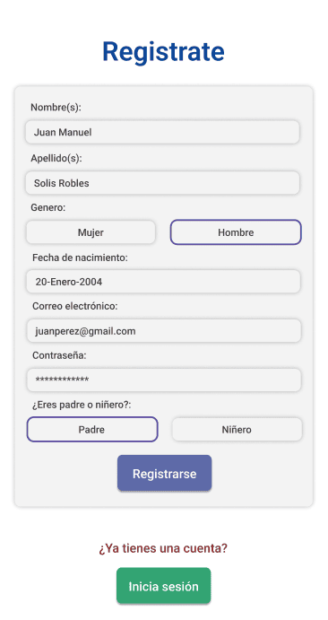 |

### 2. Panel principal e hijos
Visualiza el panel de inicio y gestiona la información de los pequeños de la casa.

| Inicio | Hijos | Registrar hijo |
|:---:|:---:|:---:|
| 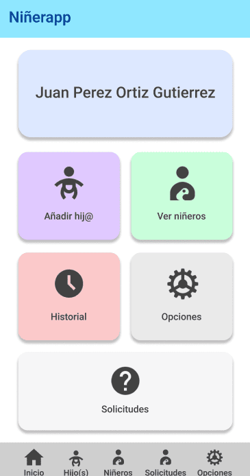 | 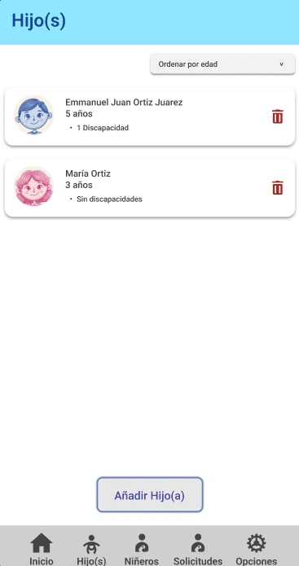 | 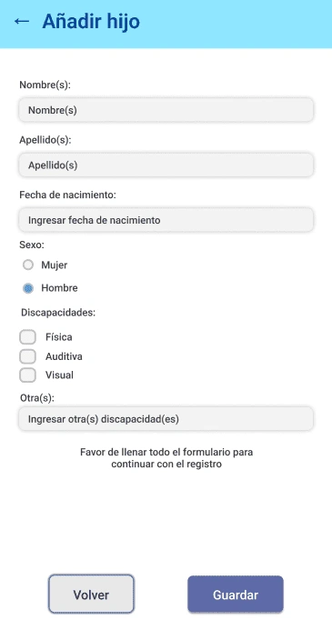 |

### 3. Niñeros(as)
Encuentra al cuidador ideal revisando su información y experiencia.

| Lista de niñeros | Perfil del niñero |
|:---:|:---:|
| 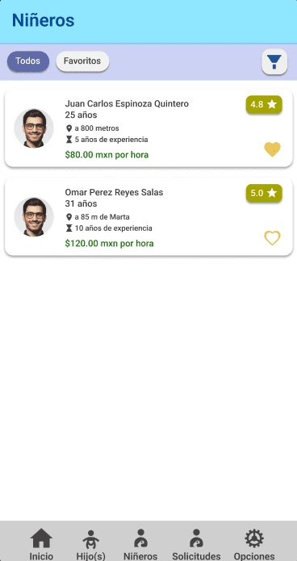 | 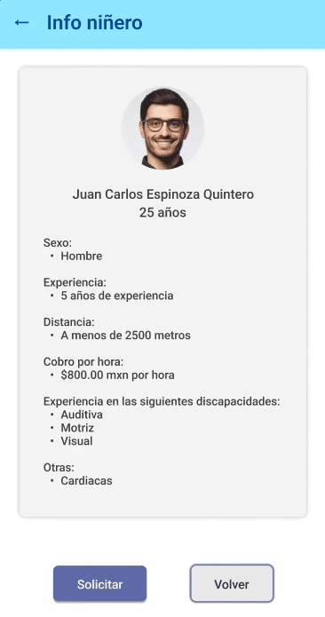 |

### 4. Servicios y comunicación
Gestiona tus servicios activos, solicita nuevos y mantente en contacto.

| Servicios | Solicitar niñero | Chat | Historial |
|:---:|:---:|:---:|:---:|
| 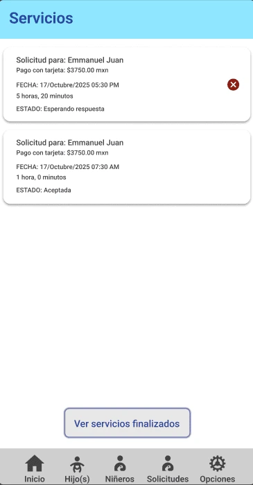 | 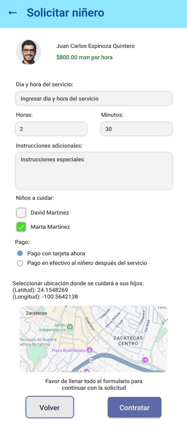 | 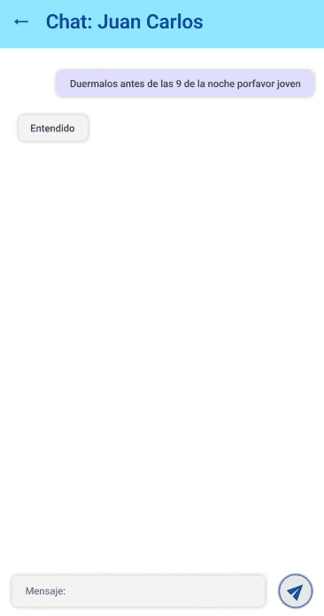 | 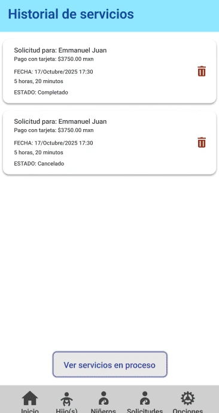 |
